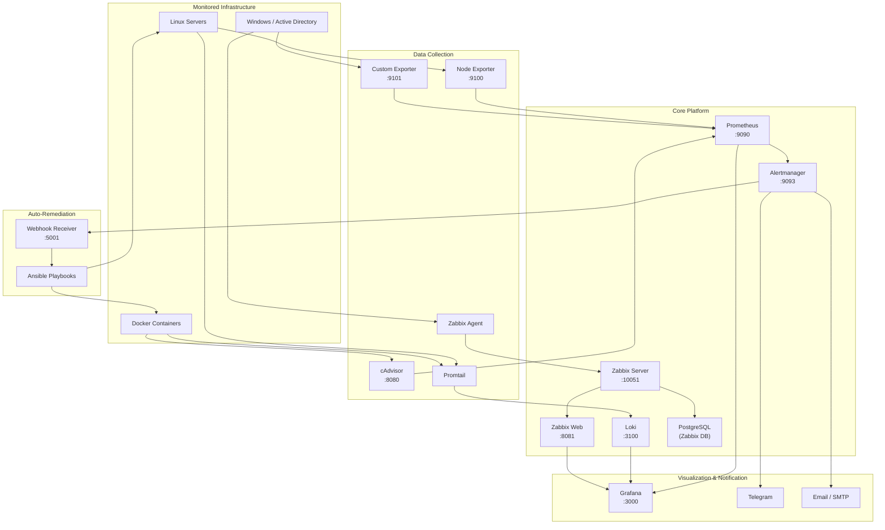

```
 ██████╗  █████╗ ███╗   ██╗ ██████╗ ██████╗ ████████╗███████╗███████╗
 ██╔══██╗██╔══██╗████╗  ██║██╔═══██╗██╔══██╗╚══██╔══╝██╔════╝██╔════╝
 ██████╔╝███████║██╔██╗ ██║██║   ██║██████╔╝   ██║   █████╗  ███████╗
 ██╔═══╝ ██╔══██║██║╚██╗██║██║   ██║██╔═══╝    ██║   ██╔══╝  ╚════██║
 ██║     ██║  ██║██║ ╚████║╚██████╔╝██║        ██║   ███████╗███████║
 ╚═╝     ╚═╝  ╚═╝╚═╝  ╚═══╝ ╚═════╝ ╚═╝        ╚═╝   ╚══════╝╚══════╝
 Unified Monitoring & Alerting System
```


---

## Overview

**PANOPTES** (Unified Monitoring & Alerting System) -- named after the all-seeing giant of Greek mythology -- is a comprehensive monitoring and alerting platform designed for university IT infrastructure at **CeDAR -- Center for Data Analytics Research at ADA University**. It integrates Prometheus, Grafana, Loki, Zabbix, and custom-built components into a single, cohesive platform deployed on Kubernetes (K3s). Panoptes provides real-time infrastructure observability, intelligent alerting with multi-channel notifications, log aggregation, and automated self-healing remediation -- enabling the CeDAR operations team to maintain high availability and rapidly respond to incidents.

---

## Architecture



---

## Quick Start

```bash
# 1. Clone the repository
git clone https://github.com/ada-university/panoptes.git && cd panoptes

# 2. Create your environment configuration
cp .env.example .env   # Edit .env with your actual credentials

# 3. Start all services
make up
```

Grafana will be available at [http://localhost:3000](http://localhost:3000) (default credentials: `admin` / `panoptes2026`).

---

## Features

- **Real-time infrastructure monitoring** -- CPU, memory, disk, network, and system load tracked at 15-second intervals via Prometheus and Node Exporter
- **Log aggregation and analysis** -- Centralized log collection with Loki and Promtail, covering system logs, auth logs, Docker container logs, and systemd journals
- **Intelligent alerting with multi-channel notifications** -- 26 alert rules with routing to Telegram and Email based on severity
- **Automated self-healing remediation** -- Webhook receiver triggers Ansible playbooks to clean disks, clear memory, restart failed services, and more
- **Windows Server / Active Directory monitoring** -- Custom exporter with LDAP health checks for domain controllers and AD replication status
- **Custom metrics collection** -- Python-based exporter for HTTP health checks, TLS certificate expiry, SSH intrusion attempts, and AD health
- **8 pre-built Grafana dashboards** -- Infrastructure Overview, Node Detail, Docker Containers, Loki Logs, Alertmanager Overview, PANOPTES Custom Metrics, Active Directory, and System Health
- **Kubernetes-ready deployment** -- Full K3s manifests with Ingress, PVCs, ConfigMaps, and TLS termination via Traefik

---

## Tech Stack

| Component | Technology | Version | Purpose |
|---|---|---|---|
| Metrics Database | Prometheus | v3.2.1 | Time-series metrics collection and storage |
| Visualization | Grafana | v11.5.2 | Dashboards, alerting UI, and data exploration |
| Log Aggregation | Loki | v3.4.2 | Horizontally-scalable log storage and querying |
| Log Shipping | Promtail | v3.4.2 | Agent that ships logs to Loki |
| Alert Routing | Alertmanager | v0.28.1 | Alert deduplication, grouping, and routing |
| Host Metrics | Node Exporter | v1.9.0 | Hardware and OS metrics for Linux hosts |
| Container Metrics | cAdvisor | v0.51.0 | Resource usage and performance metrics for containers |
| Network Monitoring | Zabbix Server | 7.4 (Alpine) | Agent-based monitoring for Windows/AD |
| Zabbix Frontend | Zabbix Web (Nginx) | 7.4 (Alpine) | Web interface for Zabbix |
| Zabbix Database | PostgreSQL | 16 | Backend database for Zabbix |
| Custom Exporter | Python (prometheus_client) | Custom | HTTP health, cert expiry, AD health, SSH metrics |
| Webhook Receiver | Python (FastAPI) | Custom | Receives alerts and triggers Ansible remediation |
| Remediation | Ansible | Latest | Automated playbooks for self-healing actions |
| Orchestration | K3s (Kubernetes) | Latest | Lightweight Kubernetes for production deployment |
| Reverse Proxy | Traefik | Built into K3s | TLS termination and Ingress routing |
| Containerization | Docker Compose | Latest | Local and VPS deployment orchestration |

---

## Project Structure

```
panoptes/
├── configs/
│   ├── alertmanager/
│   │   └── alertmanager.yml            # Alert routing, receivers, inhibit rules
│   ├── grafana/
│   │   ├── dashboards/
│   │   │   ├── alertmanager-overview.json
│   │   │   ├── docker-containers.json
│   │   │   ├── infrastructure-overview.json
│   │   │   ├── loki-logs.json
│   │   │   ├── node-detail.json
│   │   │   └── panoptes-custom-metrics.json
│   │   └── provisioning/
│   │       ├── dashboards/dashboards.yml
│   │       └── datasources/datasources.yml
│   ├── loki/
│   │   └── loki-config.yaml            # Loki storage, schema, retention
│   ├── prometheus/
│   │   ├── alert_rules.yml             # 26 alert rules across 4 groups
│   │   └── prometheus.yml              # Scrape configs, global settings
│   └── promtail/
│       └── promtail-config.yaml        # Log scrape targets and pipelines
├── docs/
│   ├── architecture.md                 # System architecture deep-dive
│   ├── setup-guide.md                  # Complete deployment guide
│   ├── alert-rules-reference.md        # Alert rules table and reference
│   ├── runbook.md                      # Operational runbook for every alert
│   └── demo-script.md                  # Step-by-step demo presentation guide
├── exporters/
│   └── custom-exporter/
│       ├── collectors/
│       │   ├── __init__.py
│       │   ├── ad_health.py            # Active Directory health checks
│       │   ├── certificate_expiry.py   # TLS certificate expiry monitoring
│       │   ├── http_health.py          # HTTP endpoint health checks
│       │   └── system_metrics.py       # SSH intrusion attempt metrics
│       ├── config.yaml                 # Exporter configuration
│       ├── Dockerfile
│       ├── exporter.py                 # Main exporter entry point
│       └── requirements.txt
├── k8s/
│   ├── alertmanager/                   # Alertmanager K8s manifests
│   ├── cadvisor/                       # cAdvisor DaemonSet
│   ├── custom-exporter/                # Custom Exporter Deployment
│   ├── grafana/                        # Grafana Deployment, PVC, Ingress
│   ├── ingress/                        # Traefik Ingress rules
│   ├── prometheus/                     # Prometheus Deployment, ConfigMap, PVC
│   ├── webhook-receiver/               # Webhook Receiver Deployment
│   ├── zabbix/                         # Zabbix Server, Web, PostgreSQL
│   └── namespace.yml                   # panoptes namespace definition
├── remediation/
│   ├── ansible/
│   │   ├── ansible.cfg
│   │   ├── inventory/hosts.yml
│   │   └── playbooks/
│   │       ├── clear_memory.yml        # Drop caches, restart heavy services
│   │       ├── disk_cleanup.yml        # Docker prune, log truncation, apt clean
│   │       ├── docker_cleanup.yml      # Docker-specific cleanup
│   │       ├── restart_service.yml     # Systemd service restart with retry
│   │       └── rotate_logs.yml         # Log rotation
│   ├── scripts/
│   │   ├── simulate_cpu_spike.sh       # Trigger HighCPUUsage alert
│   │   ├── simulate_disk_full.sh       # Trigger DiskSpaceCritical alert
│   │   ├── simulate_memory_pressure.sh # Trigger HighMemoryUsage alert
│   │   └── simulate_service_down.sh    # Trigger InstanceDown alert
│   └── webhook-receiver/
│       ├── config.yaml                 # Webhook receiver configuration
│       ├── Dockerfile
│       ├── receiver.py                 # FastAPI webhook handler
│       └── requirements.txt
├── scripts/
│   ├── deploy-docker.sh                # Docker Compose deployment script
│   ├── deploy-k8s.sh                   # K3s deployment script
│   ├── import-dashboards.sh            # Grafana dashboard import utility
│   └── setup-vps.sh                    # VPS provisioning (Docker, K3s, UFW)
├── tests/                              # Test suite
├── .env.example                        # Environment variable template
├── .gitignore
├── docker-compose.yml                  # Production compose file
├── docker-compose.override.yml         # Development overrides (debug ports)
├── Makefile                            # Build and management commands
└── README.md
```

---

## Configuration Guide

PANOPTES is configured through environment variables and YAML configuration files. For a complete step-by-step guide, see **[docs/setup-guide.md](docs/setup-guide.md)**.

### Quick Configuration

1. Copy `.env.example` to `.env` and fill in your credentials:

```bash
cp .env.example .env
```

2. Key variables to configure:

| Variable | Description |
|---|---|
| `GRAFANA_ADMIN_USER` | Grafana admin username |
| `GRAFANA_ADMIN_PASSWORD` | Grafana admin password |
| `TELEGRAM_BOT_TOKEN` | Telegram bot token for alert notifications |
| `TELEGRAM_CHAT_ID` | Telegram chat/group ID for notifications |
| `SMTP_HOST` / `SMTP_PORT` | SMTP server for email alerts |
| `SMTP_USER` / `SMTP_PASSWORD` | SMTP authentication credentials |
| `ZABBIX_DB_PASSWORD` | PostgreSQL password for Zabbix |
| `DOMAIN` | Base domain for Ingress routing |

For detailed configuration of each component, notification channels, and adding new monitoring targets, refer to the [Setup Guide](docs/setup-guide.md).

---

## Dashboard Screenshots

> Screenshots are captured from the live Grafana deployment. Place your screenshots in `docs/screenshots/` and update the paths below.

| Dashboard | Screenshot |
|---|---|
| Infrastructure Overview |  |
| Node Detail |  |
| Docker Containers |  |
| Loki Log Explorer |  |
| Alertmanager Overview |  |
| PANOPTES Custom Metrics |  |
| Active Directory |  |
| System Health |  |

---

## Alert Rules

PANOPTES ships with **26 pre-configured alert rules** organized into four groups:

- **Host Alerts** (15 rules) -- InstanceDown, CPU, memory, disk, swap, load, network, file descriptors, systemd, clock skew, OOM kills
- **Container Alerts** (4 rules) -- Container CPU, memory, restart loops, OOM kills
- **Monitoring Stack Alerts** (5 rules) -- Self-monitoring for Prometheus, Alertmanager, Loki, Grafana
- **Predictive Alerts** (2 rules) -- Disk fill prediction, memory leak detection

For the complete reference table with expressions, thresholds, and remediation mappings, see **[docs/alert-rules-reference.md](docs/alert-rules-reference.md)**.

For operational runbooks describing investigation and resolution steps for each alert, see **[docs/runbook.md](docs/runbook.md)**.

---

## Auto-Remediation

PANOPTES includes an automated self-healing pipeline that responds to specific alerts without human intervention.

### How It Works

```
Alert fires in Prometheus
    |
    v
Alertmanager routes alerts with a "remediation" label
to the webhook-remediation receiver
    |
    v
Webhook Receiver (FastAPI, port 5001) receives the alert payload,
extracts the remediation type and target host
    |
    v
Ansible playbook executes on the target host
(with a 30-minute cooldown per host/action pair)
    |
    v
Remediation result is logged and stored in history
```

### Available Remediation Actions

| Remediation Key | Ansible Playbook | Triggered By | Actions Performed |
|---|---|---|---|
| `disk_cleanup` | `disk_cleanup.yml` | DiskSpaceCritical | Docker prune, truncate large logs, vacuum journal, apt autoclean |
| `restart_service` | `restart_service.yml` | SystemdServiceFailed | Restart the failed systemd service with retry |
| `clear_memory` | `clear_memory.yml` | HostOutOfMemory | Drop page cache, restart memory-heavy services |
| `rotate_logs` | `rotate_logs.yml` | DiskFillingUp | Force log rotation |
| `docker_cleanup` | `docker_cleanup.yml` | ContainerHighMemory | Docker-specific cleanup operations |

The webhook receiver exposes the following API endpoints:

- `POST /webhook` -- Receives Alertmanager webhook payloads
- `GET /health` -- Health check
- `GET /history` -- Recent remediation execution history (last 50 entries)
- `GET /cooldowns` -- Currently active cooldown timers

---

## Contributing

We welcome contributions to PANOPTES. To contribute:

1. Fork the repository
2. Create a feature branch (`git checkout -b feature/your-feature`)
3. Make your changes and ensure all validations pass:
   ```bash
   make validate          # Validates Prometheus config, alert rules, YAML, and Compose
   make lint              # Runs ruff linter on Python code
   make test              # Runs the test suite
   ```
4. Commit your changes with a descriptive message
5. Push to your fork and open a Pull Request

### Development Setup

Use the development override for debug logging and extra ports:

```bash
docker compose -f docker-compose.yml -f docker-compose.override.yml up -d
```

### Code Style

- Python: Follows [Ruff](https://github.com/astral-sh/ruff) defaults
- YAML: Validated with `yamllint`
- Prometheus rules: Validated with `promtool`

---

## License

This project is licensed under the **MIT License**. See [LICENSE](LICENSE) for details.

---

## Authors

**Senior Design Project**
ADA University, Baku, Azerbaijan

Built for the **CeDAR -- Center for Data Analytics Research** infrastructure team.

---

<p align="center">
  <sub>PANOPTES -- Unified Monitoring & Alerting System | ADA University | 2026</sub>
</p>
