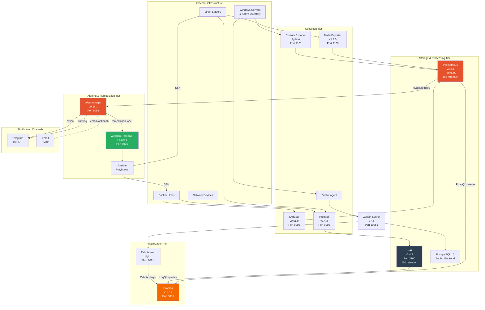
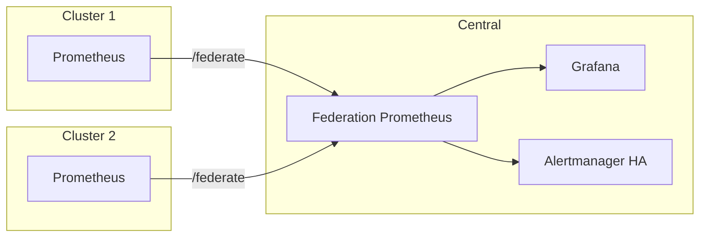

# UMAS Architecture

This document describes the architecture of the Unified Monitoring & Alerting System (UMAS), including component responsibilities, data flows, network topology, security considerations, and scaling strategies.

---

## Table of Contents

1. [System Overview](#system-overview)
2. [Architecture Diagram](#architecture-diagram)
3. [Component Descriptions](#component-descriptions)
4. [Data Flow](#data-flow)
5. [Network Topology](#network-topology)
6. [Security Model](#security-model)
7. [Scaling Strategy](#scaling-strategy)
8. [Storage and Retention](#storage-and-retention)
9. [High Availability Considerations](#high-availability-considerations)

---

## System Overview

UMAS is a multi-layered monitoring platform composed of four functional tiers:

1. **Data Collection Tier** -- Agents and exporters running on monitored hosts that collect metrics and logs
2. **Storage and Processing Tier** -- Prometheus for time-series metrics, Loki for logs, PostgreSQL for Zabbix state
3. **Alerting and Remediation Tier** -- Alertmanager for routing and deduplication, webhook receiver for automated response
4. **Visualization Tier** -- Grafana for dashboards, Zabbix Web for agent-based monitoring

Each tier is independently deployable and horizontally scalable. The platform supports both Docker Compose (development/single-server) and Kubernetes/K3s (production) deployment models.

---

## Architecture Diagram



---

## Component Descriptions

### Prometheus (Metrics Database)

- **Image**: `prom/prometheus:v3.2.1`
- **Port**: 9090
- **Purpose**: Central metrics database. Scrapes all exporters every 15 seconds, evaluates 26 alert rules every 15 seconds, and provides PromQL query interface for Grafana.
- **Why chosen**: Industry standard for cloud-native metrics. Pull-based model simplifies firewall configuration. Powerful query language (PromQL). Native integration with Alertmanager and Grafana.
- **Configuration**: `configs/prometheus/prometheus.yml`, `configs/prometheus/alert_rules.yml`
- **Storage**: 15-day retention, 10 GB size limit, TSDB on persistent volume

### Grafana (Visualization)

- **Image**: `grafana/grafana:11.5.2`
- **Port**: 3000
- **Purpose**: Unified dashboard platform. Connects to Prometheus (metrics), Loki (logs), and Zabbix (agent-based data) as data sources. Ships with 8 pre-provisioned dashboards.
- **Why chosen**: Supports multiple data sources in a single pane of glass. Rich visualization library. Dashboard-as-code via provisioning. Extensive plugin ecosystem (Zabbix plugin for AD monitoring).
- **Plugins**: `alexanderzobnin-zabbix-app`, `grafana-clock-panel`, `grafana-piechart-panel`
- **Configuration**: `configs/grafana/provisioning/`

### Loki (Log Aggregation)

- **Image**: `grafana/loki:3.4.2`
- **Port**: 3100
- **Purpose**: Log aggregation engine. Indexes log metadata (labels) rather than full text, making it cost-effective and performant. Stores system logs, auth logs, Docker container logs, and systemd journal entries.
- **Why chosen**: Designed to work seamlessly with Grafana. Label-based indexing is resource-efficient compared to full-text indexing (e.g., Elasticsearch). Same label model as Prometheus.
- **Configuration**: `configs/loki/loki-config.yaml`
- **Storage**: TSDB schema v13, filesystem-backed, 15-day retention with compactor

### Promtail (Log Shipper)

- **Image**: `grafana/promtail:3.4.2`
- **Port**: 9080 (internal)
- **Purpose**: Agent that reads log files and Docker container logs, applies labels and pipeline stages, and pushes entries to Loki.
- **Why chosen**: Native Loki companion. Supports static file scraping, Docker service discovery, systemd journal reading, and regex pipeline stages.
- **Configuration**: `configs/promtail/promtail-config.yaml`

### Alertmanager (Alert Routing)

- **Image**: `prom/alertmanager:v0.28.1`
- **Port**: 9093
- **Purpose**: Receives alerts from Prometheus, deduplicates them, groups by alertname/severity/instance, and routes to appropriate notification channels. Warning alerts go to Telegram; critical alerts go to Telegram with higher urgency; alerts with a `remediation` label are additionally forwarded to the webhook receiver.
- **Why chosen**: Native Prometheus integration. Supports grouping, inhibition, silencing, and multi-receiver routing. Prevents notification storms during cascading failures.
- **Configuration**: `configs/alertmanager/alertmanager.yml`

### Node Exporter (Host Metrics)

- **Image**: `prom/node-exporter:v1.9.0`
- **Port**: 9100
- **Purpose**: Exposes Linux host metrics (CPU, memory, disk, network, filesystem, load, systemd units) in Prometheus format.
- **Why chosen**: Official Prometheus exporter for hardware metrics. Lightweight, battle-tested, and covers all standard OS-level metrics.

### cAdvisor (Container Metrics)

- **Image**: `gcr.io/cadvisor/cadvisor:v0.51.0`
- **Port**: 8080
- **Purpose**: Collects resource usage and performance characteristics of running Docker containers (CPU, memory, network I/O, filesystem).
- **Why chosen**: Google-maintained, provides per-container metrics that Node Exporter cannot (it sees the host aggregate). Required for container-level alerting.

### Zabbix Server + Web + PostgreSQL (Agent-Based Monitoring)

- **Images**: `zabbix/zabbix-server-pgsql:alpine-7.4-latest`, `zabbix/zabbix-web-nginx-pgsql:alpine-7.4-latest`, `postgres:16`
- **Ports**: 10051 (server), 8081 (web)
- **Purpose**: Agent-based monitoring for Windows servers and Active Directory. Zabbix agents on Windows hosts report to the Zabbix server, which stores data in PostgreSQL. Grafana connects to Zabbix via the Zabbix plugin.
- **Why chosen**: Zabbix has mature Windows agent support, native Active Directory monitoring templates, and SNMP support for network devices -- capabilities that Prometheus exporters lack for the Windows/AD ecosystem.

### Custom Exporter (Application-Level Metrics)

- **Image**: Custom Python build (`exporters/custom-exporter/`)
- **Port**: 9101
- **Purpose**: Collects UMAS-specific metrics that no off-the-shelf exporter provides:
  - **HTTP Health** -- Probes Grafana, Prometheus, Alertmanager, and Loki health endpoints
  - **Certificate Expiry** -- Monitors TLS certificate expiration for all public-facing services
  - **Active Directory Health** -- LDAP connectivity and replication checks for domain controllers (when enabled)
  - **System Metrics** -- SSH login attempt tracking from auth.log
- **Why chosen**: Fills gaps that standard exporters cannot cover. Written in Python using `prometheus_client` for native Prometheus metric exposition.

### Webhook Receiver (Auto-Remediation)

- **Image**: Custom Python build (`remediation/webhook-receiver/`)
- **Port**: 5001
- **Purpose**: Receives webhook payloads from Alertmanager for alerts that carry a `remediation` label. Maps the remediation type to an Ansible playbook and executes it against the target host. Implements a 30-minute cooldown per host/action pair to prevent remediation loops.
- **Why chosen**: Bridges the gap between monitoring and automated response. FastAPI provides a lightweight, async HTTP server. Ansible provides idempotent, SSH-based remote execution.
- **Endpoints**: `POST /webhook`, `GET /health`, `GET /history`, `GET /cooldowns`

---

## Data Flow

### Metrics Collection Flow

```
Linux Host
    |
    | (Node Exporter exposes /metrics on :9100)
    v
Prometheus (scrapes every 15s)
    |
    | (stores in TSDB, evaluates alert rules)
    v
Alertmanager (receives firing/resolved alerts)
    |
    |--> Telegram (warnings and critical alerts)
    |--> Webhook Receiver (alerts with remediation label)
    |         |
    |         v
    |     Ansible Playbook (executes on target host via SSH)
    v
Grafana (queries Prometheus via PromQL, renders dashboards)
```

### Log Collection Flow

```
System Logs (/var/log/*.log)
Auth Logs (/var/log/auth.log)
Docker Container Logs (/var/lib/docker/containers/)
Systemd Journal (/var/log/journal)
    |
    | (Promtail reads, labels, and pushes)
    v
Loki (indexes labels, stores chunks on filesystem)
    |
    | (LogQL queries)
    v
Grafana (Loki Logs dashboard, ad-hoc exploration in Explore)
```

### Alert Evaluation Flow

```
Prometheus evaluates rules every 15s
    |
    |--> Rule matches? Start "for" duration timer
    |
    |--> "for" duration elapsed? Alert transitions to FIRING
    |
    |--> FIRING alert sent to Alertmanager
            |
            |--> Group by [alertname, severity, instance]
            |--> Wait 30s (group_wait) before sending first notification
            |--> Route based on severity:
            |       warning  --> telegram-warnings receiver
            |       critical --> telegram-critical receiver
            |--> Route based on remediation label:
            |       remediation=* --> webhook-remediation receiver (continue=true)
            |--> Inhibition rules:
                    - critical suppresses warning for same alertname+instance
                    - InstanceDown suppresses all alerts for same instance
```

---

## Network Topology

### Docker Compose Deployment

All services communicate over a single Docker bridge network named `monitoring`. Service discovery is by container name.

```
Docker Network: monitoring (bridge)
├── prometheus         :9090
├── node-exporter      :9100
├── alertmanager       :9093
├── loki               :3100
├── promtail           :9080
├── grafana            :3000
├── cadvisor           :8080
├── zabbix-server      :10051
├── zabbix-web         :8081 (mapped from internal 8080)
├── zabbix-postgres    :5432
├── custom-exporter    :9101
└── webhook-receiver   :5001
```

All ports are published to the host for development access. In production, only Grafana (3000), Prometheus (9090), Alertmanager (9093), and Zabbix Web (8081) should be exposed externally.

### Kubernetes (K3s) Deployment

All resources are deployed in the `umas` namespace. Internal communication uses Kubernetes Service DNS (e.g., `prometheus.umas.svc.cluster.local`).

```
Namespace: umas
├── Deployments:
│   ├── prometheus        (ClusterIP :9090)
│   ├── alertmanager      (ClusterIP :9093)
│   ├── grafana           (ClusterIP :3000)
│   ├── custom-exporter   (ClusterIP :9101)
│   ├── webhook-receiver  (ClusterIP :5001)
│   ├── zabbix-server     (ClusterIP :10051)
│   ├── zabbix-web        (ClusterIP :8080)
│   └── zabbix-postgres   (ClusterIP :5432)
├── DaemonSets:
│   └── cadvisor          (one pod per node)
├── PVCs:
│   ├── prometheus-data   (10Gi)
│   ├── grafana-data      (5Gi)
│   ├── alertmanager-data (2Gi)
│   └── zabbix-db-data    (10Gi)
├── Ingress (Traefik):
│   ├── grafana.umas.example.com     -> grafana:3000
│   ├── prometheus.umas.example.com  -> prometheus:9090
│   ├── alertmanager.umas.example.com -> alertmanager:9093
│   └── zabbix.umas.example.com     -> zabbix-web:8080
└── Secret:
    └── umas-secrets (from .env)
```

External traffic enters through K3s's built-in Traefik Ingress controller with TLS termination.

### Port Reference

| Service | Internal Port | External Port (Docker) | K8s Service Type |
|---|---|---|---|
| Prometheus | 9090 | 9090 | ClusterIP |
| Alertmanager | 9093 | 9093 | ClusterIP |
| Grafana | 3000 | 3000 | ClusterIP |
| Loki | 3100 | 3100 | ClusterIP |
| Node Exporter | 9100 | 9100 | N/A (host network) |
| cAdvisor | 8080 | 8080 | DaemonSet |
| Custom Exporter | 9101 | 9101 | ClusterIP |
| Webhook Receiver | 5001 | 5001 | ClusterIP |
| Zabbix Server | 10051 | 10051 | ClusterIP |
| Zabbix Web | 8080 | 8081 | ClusterIP |
| PostgreSQL | 5432 | N/A | ClusterIP |

---

## Security Model

### Container Security

- **Memory limits**: Every container has a `mem_limit` set to prevent resource exhaustion (128 MB to 512 MB depending on the component)
- **Read-only mounts**: Configuration files are mounted as `:ro` (read-only) where possible
- **Non-root execution**: Prometheus, Grafana, Loki, and Alertmanager run as non-root users by default in their official images
- **Minimal images**: Alpine-based images are used for Zabbix components to reduce attack surface
- **No privileged mode**: Only cAdvisor requires `privileged: true` (necessary for full container metrics access)

### Network Security

- **Single internal network**: All inter-service communication occurs on the `monitoring` bridge network, not exposed to the internet by default
- **Kubernetes NetworkPolicies**: In K3s deployment, namespace-level isolation can be applied to restrict traffic to only required paths
- **TLS termination**: Traefik handles TLS for all external-facing services via Let's Encrypt or manual certificate provisioning
- **Firewall rules**: The VPS setup script configures UFW to allow only ports 22 (SSH), 80 (HTTP), 443 (HTTPS), 6443 (K8s API), and 10250 (Kubelet)

### Secret Management

- **Environment variables**: Sensitive values (passwords, API tokens, webhook URLs) are stored in `.env` and never committed to version control
- **Kubernetes Secrets**: In K3s, secrets are created from `.env` as a Kubernetes Secret (`umas-secrets`) and mounted into pods as environment variables
- **`.gitignore`**: The `.env` file is excluded from version control

### Access Control

- **Grafana**: Sign-up is disabled (`GF_USERS_ALLOW_SIGN_UP=false`). Admin credentials are set via environment variables
- **Zabbix**: Default admin password should be changed on first login
- **Prometheus**: Admin API and lifecycle API are enabled for operational use but should be firewalled in production
- **Alertmanager**: No built-in authentication; access should be restricted via network policies or reverse proxy

---

## Scaling Strategy

### Horizontal Scaling (Exporters and Collectors)

- **Node Exporter**: One instance per monitored host. Deployed as a DaemonSet in Kubernetes.
- **cAdvisor**: One instance per Docker host. Deployed as a DaemonSet in Kubernetes.
- **Custom Exporter**: Stateless; can be replicated for high availability. Each replica scrapes the same endpoints.
- **Promtail**: One instance per log source host. Deployed as a DaemonSet when monitoring multiple nodes.

### Vertical Scaling (Storage Components)

- **Prometheus**: Scale vertically by increasing `mem_limit` and storage volume size. For very large deployments, consider Thanos or Cortex for long-term storage and horizontal query scaling.
- **Loki**: Scale vertically by increasing memory and disk. For high-volume log environments, Loki supports a microservices deployment mode with separate ingester, distributor, and querier components.
- **PostgreSQL (Zabbix)**: Scale vertically with more CPU and memory. For HA, use PostgreSQL replication.

### Federation for Multi-Cluster

For monitoring multiple clusters or data centers:

1. Deploy a local Prometheus in each cluster with local alert rules
2. Configure a central "federation" Prometheus that scrapes `/federate` from each cluster's Prometheus
3. Central Grafana connects to both local and federated Prometheus instances
4. Alertmanager can be run in HA mode (gossip protocol) across clusters



---

## Storage and Retention

### Prometheus TSDB

| Setting | Value | Notes |
|---|---|---|
| Retention time | 15 days | `--storage.tsdb.retention.time=15d` |
| Retention size | 10 GB | `--storage.tsdb.retention.size=10GB` |
| Scrape interval | 15 seconds | Global default |
| Block duration | 2 hours | Default TSDB block size |
| Compaction | Automatic | Prometheus compacts blocks in the background |

**Estimated storage**: With ~12 services scraped at 15s intervals producing ~500 time series each, expect approximately 2-4 GB of TSDB data over 15 days.

### Loki Storage

| Setting | Value | Notes |
|---|---|---|
| Schema | TSDB v13 | Most recent schema version |
| Object store | Filesystem | `/loki/chunks` directory |
| Index | TSDB | `/loki/tsdb-index` directory |
| Retention period | 360 hours (15 days) | Enforced by compactor |
| Ingestion rate limit | 16 MB/s | Per-tenant limit |
| Compaction interval | 10 minutes | Background compaction |
| WAL | Enabled | Write-ahead log for durability |

### Persistent Volume Sizing (Kubernetes)

| PVC | Size | Component | Notes |
|---|---|---|---|
| `prometheus-data` | 10 Gi | Prometheus TSDB | Matches retention size limit |
| `grafana-data` | 5 Gi | Grafana | Dashboards, plugins, SQLite DB |
| `alertmanager-data` | 2 Gi | Alertmanager | Notification log and silences |
| `zabbix-db-data` | 10 Gi | PostgreSQL | Zabbix history and trends |

---

## High Availability Considerations

### Current Design (Single-Instance)

The current deployment runs all components as single instances. This is appropriate for:

- Development and testing environments
- Small to medium university infrastructure (up to ~50 monitored hosts)
- Budget-constrained deployments

### Recommended HA Upgrades for Production

| Component | HA Strategy | Implementation |
|---|---|---|
| Prometheus | Run 2 identical instances, both scraping the same targets | Use `--web.enable-lifecycle` for config reloads. Grafana can query either. Alertmanager deduplicates alerts from both. |
| Alertmanager | Cluster mode with gossip protocol | Run 2-3 instances with `--cluster.peer` flags. Automatic deduplication of notifications. |
| Grafana | Multiple read replicas behind a load balancer | Share a common PostgreSQL or MySQL database for dashboard state. |
| Loki | Microservices mode with replication | Deploy separate ingester, distributor, and querier components with `replication_factor: 3`. |
| PostgreSQL | Streaming replication with automatic failover | Use Patroni or pg_auto_failover for automated failover. |
| Webhook Receiver | Multiple replicas with shared cooldown state | Move cooldown state to Redis or a shared database to support multiple instances. |

### Backup Strategy

- **Prometheus**: TSDB snapshots via the Admin API (`/api/v1/admin/tsdb/snapshot`)
- **Grafana**: Dashboard JSON exports (automated via `scripts/import-dashboards.sh`) and SQLite database backups
- **Loki**: Filesystem-level backups of `/loki/chunks` and `/loki/tsdb-index`
- **PostgreSQL**: `pg_dump` for Zabbix database, scheduled via cron
- **Configuration**: All configuration is version-controlled in Git
